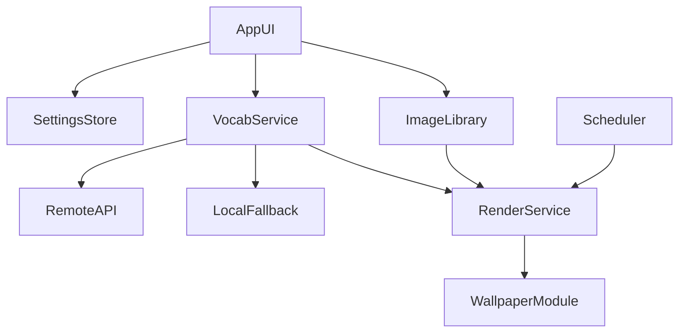

# Vocab Wallpaper App Plan

## Scope and Constraints

- React Native for cross-platform UI; Android-first for wallpaper setting.
- Android lock screen updates via native module using `WallpaperManager` with `FLAG_LOCK` (API 24+).
- iOS: no programmatic lock-screen wallpaper changes; plan for a reduced feature set or alternative UX.

## Architecture Overview

## Implementation Steps

1. Scaffold React Native project and baseline screens

   - Create a new RN app and add core screens: onboarding, image picker, preview, settings.
   - Files to add: [`App.tsx`](/Users/ericamendez/Desktop/code/my-projects/vocab-mobile-app/App.tsx) and UI screens under [`src/screens`](/Users/ericamendez/Desktop/code/my-projects/vocab-mobile-app/src/screens).

2. Image selection and storage

   - Integrate an image picker and persist chosen image URIs.
   - Store user preferences in a local store (e.g., AsyncStorage).
   - Files: [`src/services/ImageLibrary.ts`](/Users/ericamendez/Desktop/code/my-projects/vocab-mobile-app/src/services/ImageLibrary.ts), [`src/store/settings.ts`](/Users/ericamendez/Desktop/code/my-projects/vocab-mobile-app/src/store/settings.ts).

3. Vocab fetching with fallback

   - Create `VocabService` to fetch from remote API and cache results.
   - Add a local starter JSON for offline fallback.
   - Files: [`src/services/VocabService.ts`](/Users/ericamendez/Desktop/code/my-projects/vocab-mobile-app/src/services/VocabService.ts), [`assets/vocab_fallback.json`](/Users/ericamendez/Desktop/code/my-projects/vocab-mobile-app/assets/vocab_fallback.json).

4. Render word + definition onto image

   - Implement an image composition service (e.g., `react-native-skia` or canvas) to draw text over photos and export a bitmap.
   - Files: [`src/services/RenderService.ts`](/Users/ericamendez/Desktop/code/my-projects/vocab-mobile-app/src/services/RenderService.ts).

5. Android native module + scheduler

   - Add a native Android module to set lock screen wallpaper.
   - Schedule hourly updates using WorkManager from a native headless task.
   - Files: [`android/app/src/main/java/.../WallpaperModule.kt`](/Users/ericamendez/Desktop/code/my-projects/vocab-mobile-app/android/app/src/main/java/.../WallpaperModule.kt), [`android/app/src/main/java/.../VocabWallpaperWorker.kt`](/Users/ericamendez/Desktop/code/my-projects/vocab-mobile-app/android/app/src/main/java/.../VocabWallpaperWorker.kt).

6. App flow and settings

   - Settings to enable/disable hourly updates, select frequency, and preview next wallpaper.
   - Wire scheduling on settings changes.
   - Files: [`src/screens/SettingsScreen.tsx`](/Users/ericamendez/Desktop/code/my-projects/vocab-mobile-app/src/screens/SettingsScreen.tsx).

7. QA checklist

   - Verify permissions, background execution, and reliability on Android.
   - Document iOS limitations and possible alternative UX (e.g., export wallpaper instead).

## Notes on iOS

- iOS does not permit third-party apps to automatically set lock-screen wallpaper.
- For iOS, we can still generate the wallpaper and let the user save/apply manually.

## Tasks

- [ ] Scaffold React Native app shell and baseline screens
- [ ] Implement image picker and persist selected wallpaper images
- [ ] Build vocab fetch service with remote API + local fallback cache
- [ ] Render vocab word/definition overlay onto selected images
- [ ] Add Android native module for lock screen wallpaper updates
- [ ] Schedule hourly updates via WorkManager and wire settings UI