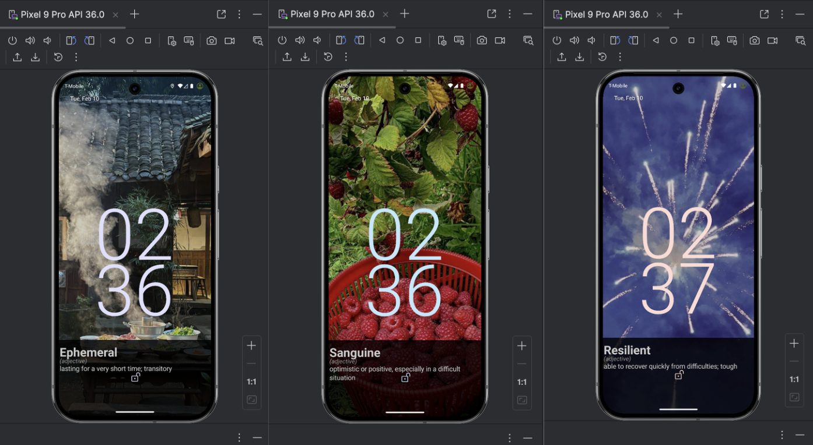
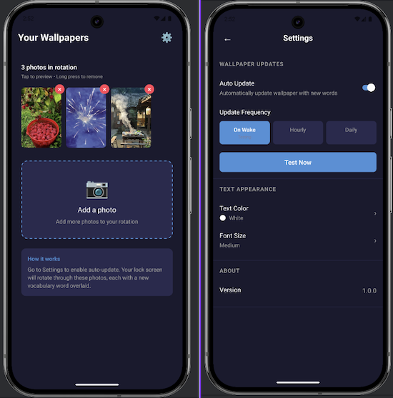

# LockNLearn

**Learn something new every time you check your phone.**

An Android app that dynamically updates your lock screen wallpaper with vocabulary words and definitions. Choose your favorite photos, and LockNLearn overlays with educational content. No need to remember to open an app, turn every glance at your phone into a learning opportunity.

## Lock Screen View


## App View


## Features

- **Custom Wallpapers** — Use your own photos as the background
- **Vocabulary Overlay** — Words with definitions displayed on your lock screen
- **Auto-Update** — Wallpaper refreshes hourly, daily, or on screen wake
- **Customizable** — Adjust text color and font size
- **Offline Support** — Works without internet using cached words

## Tech Stack

| Category | Technology |
|----------|------------|
| Framework | [React Native](https://reactnative.dev/) 0.83 |
| Language | TypeScript |
| Navigation | React Navigation |
| Storage | AsyncStorage |
| Native Features | Kotlin (Android wallpaper & scheduling) |
| Testing | Jest + React Native Testing Library |

## Getting Started

### Prerequisites

- Node.js 20+
- Android Studio with Android SDK
- A physical Android device or emulator

> **Note**: Complete the [React Native Environment Setup](https://reactnative.dev/docs/set-up-your-environment) before proceeding.

### Installation

```bash
# Clone the repository
git clone https://github.com/yourusername/locknlearn.git
cd locknlearn

# Install dependencies
npm install
```

### Running the App

```bash
# Start Metro bundler
npm start

# In a new terminal, build and run on Android
npm run android
```

The app will launch on your connected Android device or emulator.

### iOS Support

> ⚠️ **Note**: This app is currently developed and tested for Android only. iOS support has not been verified and native wallpaper features may not work.

## Project Structure

```
├── src/
│   ├── components/     # Reusable UI components
│   ├── screens/        # App screens (Onboarding, ImagePicker, Preview, Settings)
│   ├── services/       # Business logic (vocab fetching, image processing)
│   ├── store/          # State management & persistence
│   ├── navigation/     # React Navigation setup
│   └── types/          # TypeScript type definitions
├── android/            # Native Android code (Kotlin)
├── assets/             # Static assets & fallback vocab data
└── __tests__/          # Unit tests
```

## How It Works

1. **Select Photos** — Pick images from your gallery to use as wallpaper backgrounds
2. **Configure Settings** — Choose update frequency and text appearance
3. **Enable Auto-Update** — The app runs in the background, updating your lock screen with new vocabulary words
4. **Learn Passively** — Every time you check your phone, you see a new word!

If you're having issues getting the above steps to work, see the [Troubleshooting](https://reactnative.dev/docs/troubleshooting) page.

# Learn More

## License

This project is for personal/educational use.
